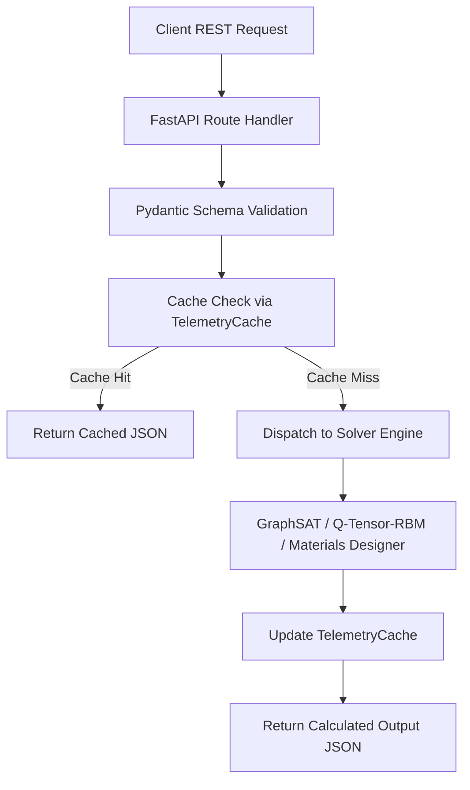

# 🎛️ Axiomatic-Engine-FastAPI: Scientific Computing Gateway

Axiomatic-Engine-FastAPI is a high-throughput API gateway and microservice orchestrator designed to expose mathematical, quantum, and materials simulations through a unified REST API. Built on FastAPI and Pydantic, the gateway integrates with GraphSAT, Q-Tensor-RBM, and Superconductor-Design-ML to handle heavy computations, manage in-memory caches, and coordinate long-running background tasks.

---

## 🛠️ API Specifications & Schema

```
Axiomatic API Server (port: 8000)
├── GET  /                          -> Health check & active engine checks
├── POST /solve/sat                 -> Solves boolean SAT constraints (GraphSAT)
├── POST /solve/quantum             -> Emulates multi-state registers (Q-Tensor-RBM)
├── POST /solve/materials           -> Predicts superconductor Tc (Allen-Dynes)
├── POST /simulation                -> Launches a simulated background task
└── GET  /simulation/{task_id}      -> Polls active task telemetry & progress
```

### 1. Request/Response Data Validation
Inputs are validated at the API boundary using Pydantic schemas:
- **SAT solving**: `num_vars` (integer), `clauses` (list of list of integers).
- **Quantum emulation**: `n_registers` (integer), `dimension` (integer), `bond_dim` (integer).
- **Materials screening**: `hydrogen_count` (integer), `heavy_atom_mass` (float).

### 2. Telemetry Caching
A thread-safe in-memory cache intercepts incoming solver payloads. By hashing request arrays, identical calculations bypass solver execution and are returned instantly within their designated Time-To-Live (TTL) lifespan.

---

## 📐 Workings & Pipeline



1. **Routing**: FastAPI routes request payloads to target solver controllers.
2. **Dynamic Integration**: Gracefully detects on-disk packages (GraphSAT, Quantum, Materials) using try-except modules, failing back to mock computations if siblings are missing.
3. **Background Telemetry**: Spawns non-blocking tasks using ASGI background threads. Clients poll the simulation registry to track execution progress from 0% to 100%.

---

## 💎 Key Advantages

- **Zero-Redundancy Computations**: TTL-based hashing ensures that duplicate request footprints are resolved instantly.
- **Graceful Degradation**: Fully operational in standalone environments via built-in simulation fallbacks.
- **Telemetry Ready**: Designed for WebSockets or polling loops, facilitating progress displays in React frontends.

---

## 📦 How to Install and Run

### Prerequisites
- Python 3.9 or higher

### Setup
Navigate to the directory and install dependencies:
```bash
pip install -r backend/requirements.txt
pip install -e .
```

### Running Tests
Run the API test suite using `pytest`:
```bash
pytest backend/tests/
```

### Launching the Gateway Server
Start the local server using `uvicorn`:
```bash
uvicorn app.main:app --reload --host 127.0.0.1 --port 8000
```
Open [http://127.0.0.1:8000/docs](http://127.0.0.1:8000/docs) in your browser to view the interactive Swagger documentation.

---

<div align="center">
  <a href="https://q.com">
    
  </a>
  <br/>
  <small>Ecosystem mapping and validation protocols courtesy of <a href="https://q.com">q.com</a></small>
</div>

## Performance Benchmark

*Benchmark not available:* No benchmark script found
